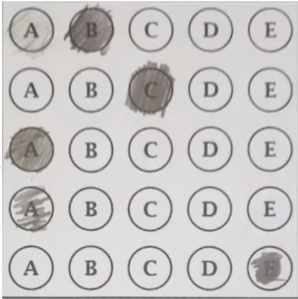

 # How to get the answer
 
1. get the original picture

2. convert it into gray scale

3. find the edge in the image

4. find the contours in the image

5. find the biggest contours in the image

6. get the warp perspective

7. use the threshold to find the mark

